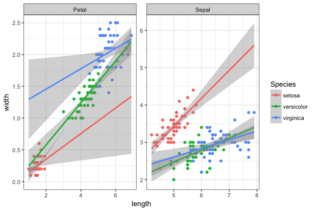

```{r setup, include=FALSE}
knitr::opts_chunk$set(echo = TRUE, cache=TRUE)
library(tidyverse)
```

##Homework 1 - to be done as groups
Names: Ciara Frances Pugh, Michael Lawrence Widdowson, Niels Rasmus Lorenzen, Oline Mathilde Pade Jensen, Shahriyar Mahdi Robbani

Group: 7

For deadlines etc, see absalon. 

You have to supply both the answer (whatever it is: numbers, a table, plots or combinations thereof), as well as the R or Linux code you used to make the plots. This should be done using this R markdown template: we want both the R markdown file and a resulting PDF. For PDF output, you may have to install some extra programs - R studio will tell you. 

Note that:

1. If the R code gives different results than your results, you will get severe point reductions or even 0 points for the exercise

2. Some questions may request you to use R options we have not covered explicitly in the course: this is part of the challenge

3. While this is a group work, we expect that everyone in the group will have understood the group solution: similar or harder question might show up in the individual homework. So, if something is hard, it means you need to spend more time on it

4. The results should be presented on a level of detail that someone else could replicate the analysis. 

For statistical tests, you have to:

1) Motivate the choice of test 

2) State exactly what the null hypothesis is (depends on test!)

3) Comment the outcome: do you reject the null hypothesis or not, and what does this mean for the actual question we wanted to answer (interpretation)?


###Question 1
Install the package babynames and look at the data babynames:

```{r, eval=FALSE}
install.packages("babynames")
```
```{r q1.part1}
library(babynames)
head(babynames)
```

a) List the top 5 female baby names starting with P, regardless of year, as a table. 

```{r}
babynames %>%
  filter(sex == "F") %>%
  group_by(name) %>%
  summarize(sum = sum(n)) %>%
  filter(str_detect(name, "^P")) %>%
  arrange(desc(sum)) %>%
  head(5) -> babynames_P
babynames_P
```


b) Using the results from a, plot their occurrences as a function of year using a line plot.  Comment on your results. If you get strange results, explain them and/or improve the plot. 

```{r}
babynames %>%
  filter(name %in% babynames_P$name) %>%
  filter(sex == "F") -> top5
ggplot(top5, aes(x = year, y = n, col = name)) +
  geom_line() + theme_bw()
```

All 5 of the most popular names peaked between 1910 and 1970 and are presently not very popular. The simultaneous peak could have been caused by the baby boom post world war 2 and a lack name variety during this period compared to the modern day. The popular 1950s song "Patricia" could have also contributed to the popularity of the name during this period.

##Question 2
In the same dataset, is the name Arwen significantly more (or less) common in 2004 vs 1990? Is the change significant? What is the likely cause? Do not use hard-coding.

We chose to perform Fisher's exact test because it is more accurate than the Chi squared test since the contigency table contains values that are low so they won't follow the Chi squared distribution.  
$H_0$: There is no significant difference between the occurence of the name "Arwen" in 1990 and 2004 i.e. the Odds Ratio will equal 1.  


```{r}
babynames %>%
  filter(name == "Arwen") %>%
  filter(year == 1990 | year == 2004) %>%
  select("Arwen" = n) -> arwen

babynames %>%
  filter(name != "Arwen") %>%
  filter(year == 1990 | year == 2004) %>%
  group_by(year) %>%
  summarize(Total = sum(n)) %>%
  select(Total) -> total

arwen_matrix <- as.matrix(cbind(arwen, total))
fisher.test(arwen_matrix)
```


Performing Fisher's exact test results p value < 0.05 so we reject $H_0$ and conclude that there is a difference in the occurence in the name. In fact, the name experiences an increase in popularity of over 16 times most likely due to the popularity of the the Lord of the Rings movie trilogy released from 2001-2003 which features a character named "Arwen".

##Question 3
Produce the following plot starting from the flowers dataset. A potentially useful function that you may not have seen: bind_rows():  merges two tibbles by rows so that the joint tibble  becomes longer, not wider



```{r}
#load data
flowers <- read_tsv("flowers.txt")
# create table of lengths
flowers %>%
  select(Species, Sepal.Length, Petal.Length) %>%
  gather(key = "Type", value = "Length", Sepal.Length, Petal.Length) %>%
  separate(Type, c("Part", NA)) -> lengths
# create table of widths
flowers %>%
  select(Species, Sepal.Width, Petal.Width) %>%
  gather(key = "Type", value = "Width", Sepal.Width, Petal.Width) %>%
  separate(Type, c("Part", NA)) -> widths
#combine tables
flowers_long <- cbind(lengths, Width = widths$Width)
#plot
ggplot(flowers_long, aes(x=Length, y = Width, col = Species)) +
  facet_wrap(~Part, scales = "free") + 
  geom_point() + 
  geom_smooth(method = "lm", fullrange = T) +
  theme_bw()
```


##Question 4
We are given a file with binding sites of a certain transcription factor, made with the ChIP-seq technique (you will hear a lot more about the technique later in the course) by a collaborator. 
In the homework directory, there is a data file 'chip_mm5.txt' from the collaborator, representing binding sites from a Chip-chip experiment, with a column for  chromosome, start, end, and score, where score is how 'good' the binding is. Our collaborator has two hypotheses:

1: Binding scores are dependent on chromosome

2: Binding site widths (end-start) are dependent on chromosome

Can you prove/disprove these two hypotheses statistically?

We perform a oneway ANOVA test as the data is normally distributed which was verified with a QQ plot.  
$H_0$: There is no significant difference between the mean binding score of the chromosome numbers.

```{r}
chip <- read_tsv("chip_mm5.txt")
chip %>%
  drop_na() %>%
  separate(chr, c(NA, "chr"), sep="r") %>%
  mutate(width = end - start) -> chip

oneway.test(score ~ chr, chip)
```


This results in a p-value of 0.4298. This is much higher than our theshold so we are unable to reject $H_0$ and must accept there is no significant different in the means, therefore the binding score is not dependent on the chromosome.

We perform a Kruskal-Wallis Rank Sum Test as the data is not normally distributed which was verified with a QQ plot.  
$H_0$: There is no significant difference in the mean ranks of the binding site widths.
```{r}
kruskal.test(width ~ chr, chip)
```

 
This results in a p-value of 0.003416. This is significantly smaller than our threshold so we reject $H_0$ and conclude the binding site width depends on the chromosome number.


