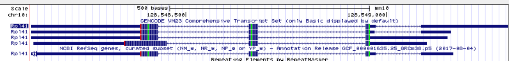

```{r setup, include=FALSE}
knitr::opts_chunk$set(echo = TRUE)
library(tidyverse)
#setwd("~/Dropbox2/Dropbox/TEACHING/BOHTA2018/homework1-3/hw2")
# change as appropriate
```
##Home work 2 - to be done as groups
Names: Ciara Frances Pugh, Michael Lawrence Widdowson, Niels Rasmus Lorenzen, Oline Mathilde Pade Jensen, Shahriyar Mahdi Robbani
Group: 7

For deadlines etc, see Absalon.

You have to supply both the answer (numbers, a table, plots or combinations thereof) as well as the R or Linux code you used to make the plots. This should be done using this R markdown template: we want both the R markdown file and a resulting PDF. For PDF output, you may have to install some extra programs - RStudio will tell you. 

Note that:

1. If the R code gives different results than your results, you will get severe point reductions or even 0 points for the exercise

2. Some questions may request you to use R options we have not covered explicitly in the course: this is part of the challenge

3. While this is a group work, we expect that everyone in the group will have understood the group solution: similar or harder question might show up in the individual homework. So, if something is hard, it means you need to spend more time on it

4. The results should be presented on a level of detail that someone else could replicate the analysis. 

For statistical tests, you have to:

1) Motivate the choice of test 

2) State exactly what the null hypothesis is (depends on test!)

3) Comment the outcome: do you reject the null hypothesis or not, and what does this mean for the actual question we wanted to answer (interpretation)?

A question marked * means that is more challenging, and likely requires skills from the whole group.

###Question 1: Dicer dissected
The human DICER1 gene encodes an important ribonuclease, involved in miRNA and siRNA processing. Several mRNAs representing this gene have been mapped to the human genome (March 2006 assembly). We will look closer at one of them with the accession number AK002007.

a) What are the first five genomic nucleotides that are read by RNA polymerae II from this transcript?  

AAAGG

b) Look at the raw mRNA sequence of AK002007, from the database it actually comes from. What are the first five nucleotides? 

GAAGC

c) How do you explain the discrepancy (maximum 5 lines)? 

When doing mRNA-seq mRNAs are reverse transcribed into cDNAs that are inserted into a plasmid. This allows for easy primer design (also allows you to use the same primer for all cDNAs), however it is not necessarily possible to have the primer right at the border between plasmid-backbone and cDNA. In his case the primer is placed 7 bases upstream of the cDNA, thus when sequencing using the primer these 7 bases will be included in the sequence.


###Question 2: ERA and ERB

Our collaborators designed a ChIP study using so-called tilling arrays (an outdated technique these days, but the top of the pop at the time: see http://en.wikipedia.org/wiki/Tiling_array): one for estrogen receptor alpha (ERA), one for estrogen receptor beta (ERB). All the sites are stored in BED files respectively for two ERs. These are now available in the homework directory, and are both mapped on hg18 genome. The current situation is that we know to some degree what ERA does, but not what ERB does (there are some evidence that they share some functions, but not all). So, we need bigger experiments and better statistics. 

a) 
Using BEDtools within Linux: What is the genome coverage (% of base pair covered at each chromosome) for ERB and ERA sites? If you need a file with chromosome sizes for hg18, it included in the assignment: hg18_chrom_sizes.txt. Plot the fractions for all chromosomes as a single barplot in R. Briefly comment the results. Is there anything particularly surprising? Try to explain the outcome (biological and/or experimental setup explanations)?

```{r, eval = FALSE, tidy=TRUE, tidy.opts=list(width.cutoff=60)}
sort -k 1,1 -k 2,2n ERa_hg18.bed | nice bedtools genomecov -i - -g hg18_chrom_sizes.txt \
  -max 1 > era_gencov2
sort -k 1,1 -k 2,2n ERb_hg18.bed | nice bedtools genomecov -i - -g hg18_chrom_sizes.txt \
  -max 1 > erb_gencov2
```

```{r}
era <- read_tsv('era_gencov2', col_names = F)
erb <- read_tsv('erb_gencov2', col_names = F)
era$BindingSite <- rep("ERA", length(era$X4))
erb$BindingSite <- rep("ERB", length(erb$X4))
era %>%
  rbind(erb) %>%
  rename(Chromosome = X1) %>%
  filter(X2 == 1) %>%
  mutate(Percentage = X5*100)  -> df

chr <- read_tsv('hg18_chrom_sizes.txt', col_names = F)
chr_empty <-
chr$X1[!chr$X1 %in% unique(df$Chromosome)] #chromosomes not in df
X <- rep(0, length(chr_empty) * 2) #mpty column
df_empty <-
data.frame(
'Chromosome' = rep(chr_empty, 2),
'X2' = X,
'X3' = X,
"X4" = X,
'X5' = X,
'BindingSite' = c(rep('ERA', length(chr_empty)), rep('ERB', length(chr_empty))),
'Percentage' = X
)
df <- rbind(df, df_empty)
chr <-
c(sapply(1:22, function(x)
paste0("chr", as.character(x))),
'chrX',
'chrY',
'chrM',
'genome')
df$Chromosome <- factor(df$Chromosome, levels = chr)

df %>%
  ggplot(aes(x=Chromosome, y=Percentage, fill=BindingSite)) + 
  geom_bar(stat = "identity", position = "dodge") + 
  theme_bw() +
  theme(legend.position = "top") +
  scale_x_discrete(guide = guide_axis(n.dodge = 2))

```

ERA and ERB exclusively bind to the same choromosomes. This supports the hypothesis that they may bind in the same regions but the resolution is not high enough to see if there are overlapping binding sites so based on this we can not say if they share some functionality.

According to Lin et al[1], there are binding sites present on chromosomes other than the ones we observe. Even if there was absolutely no binding to a chromosome, we would expect there to be at least some noise due to random binding of sites or incomplete purification. This indicates that the chromosomes did not have any probes at all. One possible reason for this is that tiling arrays are expensive and the array simply did not cover the whole genome hence binding sites on many different chromosomes were missed.

##2.a)Please plot all the chromosomes, and explain why there are so many chromosomes with no binding sites


b) 
Again, using BEDtools in Linux:  How many ERA sites do/do not overlap ERB sites, and vice versa? Show the Linux commands and then a Venn diagram summarizing the results.  The Venn diagram can be made in R using one of many venn diagram packages, but you can also make it in any drawing program. 
```{r}
#install.packages('VennDiagram')
library(VennDiagram)
```

```{bash, eval=FALSE}
bedtools intersect -a ERa_hg18.bed -b ERb_hg18.bed > intersect
sort -k 1,1 -k 2,2n ERa_hg18.bed | nice bedtools genomecov -i - -g hg18_chrom_sizes.txt \
  -max 1 > era_genomecov
sort -k 1,1 -k 2,2n ERb_hg18.bed | nice bedtools genomecov -i - -g hg18_chrom_sizes.txt \
  -max 1 > erb_genomecov
```

```{r}
era1 <- read_tsv('era_genomecov', col_names = F)
erb1 <- read_tsv('erb_genomecov', col_names = F)
both <- read_tsv('intersect', col_names = F)
```


```{r}
grid.newpage()
draw.pairwise.venn(
  nrow(era1),
  nrow(erb1),
  nrow(both),
  category = c("ERA", "ERB"),
  lty = rep("blank", 2),
  fill = c("red", "cyan")
  )
```

The Venn diagram shows that ERB and ERA bind to the some of the same sites, which would support the hypothesis that they share overlapping functions.

###Question 3: Ribosomal Gene (*)

Your group just got this email from a frustrated fellow student:

My supervisor has found something he thinks is a new ribosomal protein gene in mouse. It is at chr9:24,851,809-24,851,889, assembly mm8. His arguments for this are
a) It has high conservation in other species because ribosomal protein genes from other species map to this mouse region
b) And they are all called Rpl41 in the other species (if you turn on the other Refseq you see this clearly in fly and other species).


But, I found out that if you take the fly refseq sequence mentioned above (from Genbank) and BLAT this to the fly genome, you actually get something that looks quite different from the one in the mouse genome. How can this be? Is the mouse gene likely to be real? If not, why? (Maximum 20 lines, plus possibly genome browser pictures) 


We BLATed the fly refseq and we can only get a search result if we set the query type to translated DNA or RNA and the resulting output has an intron unlike the mouse predicted gene. This indicates the predicted gene is not real as mice genes generally have introns. We searched the RPL41 gene in other species such as humans and rats and they also had introns which further support the hypothesis that this gene is not real. 


There is only one EST to support this gene, and ESTs don't count as strong evidence especially since we don't see mRNAs annotated in this region, which further supports the hypothesis that this gene is not real.




We searched another mouse assembly (mm9) and the annotation for the gene was on a different chromosome and had introns. There are also annotations for it in mm10 and mm7.

Instead of an actual gene this sequence could be part of a retrotransposon. 
For retrotransposons to "move" they are transcribed and converted to mRNA, before being reverse transcribed and reincorporated in a new location. This makes it impossible for there to be introns. 
Retrotransposon can be formed as a result of retroviral infections or retrotranspositions in the germline.
Retrotransposons traditionally contain multiple elements (that originate from retrovirus); LTRs (long terminal repeats), reverse transcriptase, and others. Though it can vary, some groups have very little homology to retrovirus. LTR retrotransposons (common form, formed by retroviral infection) are generally 5-7 kb long, thus quite a bit longer than the given sequence:


When zooming out from the sequence and adding the full repeatMasker track it becomes possible to see LTRs both up and downstream of the sequence with a distrance between that fits the general lengths (approx. 6 kb in this case).

#References
[1] C. Lin et al., "Whole-Genome Cartography of Estrogen Receptor ?? Binding Sites", PLoS Genetics, vol. 3, no. 6, p. e87, 2007. Available: 10.1371/journal.pgen.0030087 [Accessed 21 May 2020].
