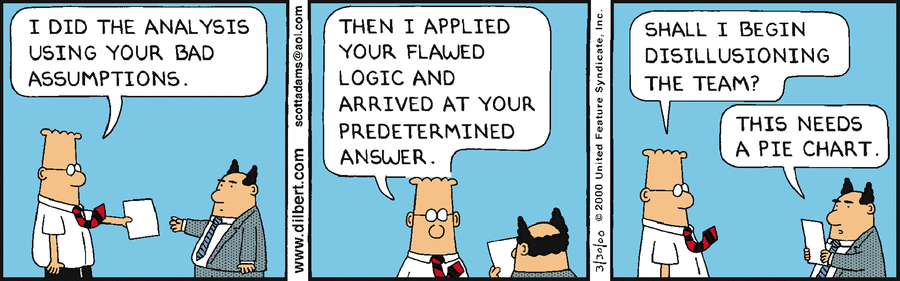

```{r setup, include=FALSE}
knitr::opts_chunk$set(echo = TRUE)

```


(Remove inspirational picture from your hand-in. It is also fine to remove introduction texts)

__Name:__

__KU id:__

#Instructions

For deadlines etc, see Digital Exam

You have to supply both the answer (numbers, tables, plots, discussion or combinations thereof) as well as the R or Unix code you used to make the plots/results. This should be done using this R markdown template: we want both the R markdown file and the resulting __html__ file (__not a PDF!__). The html file is what you will present at the oral exam, by sharing your screen. At the oral exam, there may be questions on the homework and/or anything else from the course.

In the home work part, all aids are allowed except working with others since it is an individual exam. To be clear, no copying of code or anything else between students or from other sources than the course material (e.g. slides) are allowed. If we find something like that you will be reported. 

In the oral exam part, no aids are allowed except your html file.  


Note that:

1. If the R code or UNIX commands code gives different results than your results, you will get severe point reductions or even 0 points for the exercise

2. Some questions may request you to use R or UNIX commands /options we have not covered explicitly in the course: this is part of the challenge

3. Much like in an academic paper, the analysis and results should be presented on a level of detail that someone else could replicate the analysis. If not, we will deduct points.

4. Use tidyverse for all analyses and plotting, unless we explicitly used something else in class for the relevant plot or analysis (e.g. plotting trees, expression analysis on matrices, heat maps, etc)

For statistical tests, you have to:

1. Motivate the choice of test 

2. State exactly what the null and alternative hypothesis are (depends on test!) and the P-value threshold

3. Comment the outcome: do you reject the null hypothesis or not, and what does this mean for the actual question we wanted to answer (interpretation)?


##Question 0
Load all the libraries that you use in the rest of the analyses. 

_Answer goes here_

##Question 1
### Introduction ###

Antisense transcription is a current hot topic in genomics: when a certain genomic region is transcribed on both strands. In one model, the two RNAs produced may hybridize with each other since they are complementray, and then be degraded (a type of negative regulators). In another, deregulation happens becasue of RNA polymerase collisions. 

We will now try to answer the question : How common is this in the human genome?

Use the refseq track from the hg19 assembly. 

Using R and bedtools (and possibly a text editor to add headers to bed files if needed), find out:

- 1: What fraction of refseq transcripts overlap another transcript on the opposite strand, covering at least 20% of the transcript?

_Answer goes here_

- 2: What is the distribution of of overlaps on opposite strand? E.g: plot an appropriate histogram how many refseq transcripts have 1,2,3...N opposite strand overlapping transcripts?

_Answer goes here_

- 3: What is the Refseq transcript with the largest number of overlapping transcripts on the other strand (same thresholds as above)? Show this in the genome browser, disccuss the image and suggest  how we can improve the anlaysis based on this (max 200 words). 

_Answer goes here_

##Question 2

Data is available in the folder `question2_data`

### Introduction ###
The RRP40 gene is part of the exosome complex, a molecular machine that degrades RNAs in the cells from the 3' end. Your collaborator has just made a CAGE experiment in cells in which RRP40  was depleted using a RRP40-specific siRNA. For comparison,he/she also made a control experiment where a random siRNA was used. The hope is to be able to identify what RNAs that are degraded by RRP40, becasue we should observe higher levels of these if RRP40 is depleted. They have a hypothesis that there may be RNAs transcription initiation close to known gene transcription start sites (TSSs) that we never observe in normal cells becasue the RNAs are eaten up so fast that. 

The CAGE reads are already mapped to the genome and another collaborator has already made some files for you that shows where they fall around annotated TSSs. Specifically, you are given 4 files where the rows are the -600 to +400 region around ~12.000 annotated TSSs, and the columns are the positions (so, the first is position -600 etc for respective TSS). Values  are TPM-normalized CAGE counts plus a small amount of artificially added noise to avoid model overfitting, aside from the first column which is just the genomic position we are looking at, eg chr4:10000-11000+. 

Because you have two experiments and two strands, you have four files in total. For example, the
`Hw4_CAGE_rrp40_senseStrand` file has CAGE data on the plus strand and from the RRP40 depletion experiment. "Strand" is here always relative to the annoatated TSS, which is always defined to be on the plus strand. 

These files  are quite big (around 12 million data points, or 60-70 megabyte each), and your collaborators belatedly realized they could not plot these using Excel. Panic ensued. This is why they hired you: you know how to use R and your job is now to analyze the data and visualizing the results. 

Specifically, they want you to:

Using tidyverse (except when reading in files, see below), make a plot where the Y axis is average fold change (rrp40/ctrl) and X axis is position relative to TSS (-600 to +400). Calculate fold changes for each strand  so in the end, you will have a plot with two fold change 'lines', one for each strand. Interpret the results: What are we seeing and does this agree with the text-book decription of promoters and transcription start sites? ( max 100 words) 

Tip: If numeric columns become characters during your tidyverse manipulations and you want them to be numeric, `as.numeric()` is a good function. 


_Answer goes here_

## Question 3

Data is available in the folder `question3_data`

### Introduction ###

You have been hired by the Danish pharmaceutical giant Novo Nordisk to analyze an RNA-Seq study they have recently conducted. The study involves treatment of pancreatic islet cells with a new experimental drug for treatment of type 2 diabetes. Novo Nordisk wants to investigate how the drug affects cellular mRNA levels in general, and whether the expression of key groups of genes are affected. 

As the patent for the new experimental drug is still pending, Novo Nordisk has censored the names of genes. 

You have been supplied with 4 files:

- `studyDesign.tsv`: File describing treatment of the 18 samples included in the study.
- `countMatrix.tsv`: Number of RNA-Seq reads mapping to each of the genes.
- `normalizedMatrix.tsv`: Normalized expression to each of the genes.
- `diabetesGene.tsv`: Collection of genes known to be involved in type 2 diabetes.

#### Part 1: Exploratory Data Analysis

__Question 3.1.1: Read all dataset into R, and make sure all three files have matching numbers and names of both samples and genes.__

_Answer goes here_

Next, we want to see if the data makes sense, by making a heat map and a PCA plot.

__Question 3.1.2:  Heat map: For heat maps,  it makes no sense to  include all genes - instead, we will only look at genes that vary substantially across the samples. Specifically, select the genes top 10% of genes based on their variance across all samples, and make a heat map of those using the pheatmap library (standard settings). Rows in the heat mpa should be genes, columns shoudl be samples. Make an annotation row that shows whether each sample is treatment or control. Comment on your plot__

_Answer goes here_

__Question 3.1.3: PCA: Using the normalized matrix (all genes, not the top 10% of genes as in the heat map), perform a Principal Components Analysis (PCA) on the samples and produce a PCA-plot of the two first components, where the axis labels show the amount of variance explained by each component and samples are colored by their experimental group. Find a way to label the samples, so the identity (the sample name) of each point can easily be seen (hint: look at `geom_text()` or the ggrepel package!). Note, you should center but not scale the data. Comment on your plot__

_Answer goes here_

__Question 3.1.4: Based on the two previous questions, discuss (max 50 words) whether your observations indicate that there are any problems with the data - e.g. outliers, mix ups, sub-groups. If you identified problems  try to fix them (e.g. remove clear outliers if you find them, fix mix-ups, etc ). If you make a correction, make a PCA plot with your corrected data to check that the correction is doing the right thing __

_Answer goes here_

#### Part 2: Differential Expression (DE)

__Question 3.2.1: Use  DESeq2 to obtain differentially expressed (DE) genes between the two experimental conditions. Use default parameter, except use a logFC threshold of 0.25 and an adjusted P-value threshold of 0.05. How many up-and down regulated genes are there on your corrected data compared to if you do the Deseq2 analysis on un-corrected data?__

_Answer goes here_

__Question 3.2.2: From now on, we will only analyze the corrected data. Convert the output of DESeq2 (corrected data) to a tibble, and make an MA-plot using ggplot2. The MA-plot should show the overall trend using a trend line and genes should colored according to their DE status. Discuss whether the MA-plot indicates an approriate DESeq2 analysis (max 70 words discussion).__

_Answer goes here_

__Question 3.2.3: Sort the DE statistics table  that you get from DESeq2 to report the top 10 genes sorted by__ 

__a) positive logFC (highest on top)__ 

_Answer goes here_

__b) negative logFC (lowest on top)__

_Answer goes here_

__only looking at significantly differentially expressed genes__


#### Part 3: Is the drug any good?

__Question 3.3.1: Novo Nordisk claims their treatment affects expression of genes related to diabetes. Your task is to investigate whether this is true. They have supplied you with a long list of genes that are diabetes-related - diabetesGenes.tsv. Are these genes more up/down regulated than expected by chance, by looking at log2FC values from above ?__

_Answer goes here_
