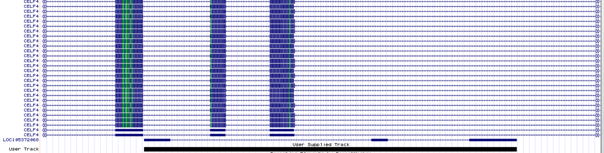

```{r setup, include=FALSE}
knitr::opts_chunk$set(echo = TRUE)

```


__Name:__ Shahriyar Mahdi Robbani

__KU id:__ XQR418


##Question 0
Load all the libraries that you use in the rest of the analyses. 

```{r}
library(tidyverse)
library(pheatmap)
library(DESeq2)
```


##Question 1
### Introduction ###

Antisense transcription is a current hot topic in genomics: when a certain genomic region is transcribed on both strands. In one model, the two RNAs produced may hybridize with each other since they are complementray, and then be degraded (a type of negative regulators). In another, deregulation happens becasue of RNA polymerase collisions. 

We will now try to answer the question : How common is this in the human genome?

Use the refseq track from the hg19 assembly. 

Using R and bedtools (and possibly a text editor to add headers to bed files if needed), find out:

- 1: What fraction of refseq transcripts overlap another transcript on the opposite strand, covering at least 20% of the transcript?

Genes and Gene prediction > NCBI Refseq > Refseq All

```{r, eval=FALSE}
bedtools intersect -a refseq -b refseq -f 0.2 -S -u > overlap-refseq-su
wc -l overlap-refseq-su #6257
wc -l refseq #77810
```
```{r}
overlap_size <- 6257
refseq_size <- 77810
overlap_size/refseq_size
```
The fraction of the genome that is transcribed in both strands is 0.08.


- 2: What is the distribution of of overlaps on opposite strand? E.g: plot an appropriate histogram how many refseq transcripts have 1,2,3...N opposite strand overlapping transcripts?


```{r, eval=FALSE}
bedtools intersect -a refseq -b refseq -f 0.2 -S -c > overlap-refseq-s-count
```

```{r}
overlap_count <- read.table("overlap-refseq-s-count")
overlap_count %>%
  filter(V13 != 0) %>%
  ggplot(aes(x=V13)) + geom_histogram() + theme_bw() +
  xlab("Number of overlaps")
```


- 3: What is the Refseq transcript with the largest number of overlapping transcripts on the other strand (same thresholds as above)? Show this in the genome browser, disccuss the image and suggest  how we can improve the anlaysis based on this (max 200 words). 

```{r}
overlap_count %>%
  arrange(desc(V13)) %>%
  head(1) %>%
  select(V1, V2, V3) %>%
  write_tsv("most_overlap", col_names = F)
```

Transcript NR_134588.1 (LOC105372068) has the highest number of overlapping transcripts at 81. This is shown in the picture below:




It can be seen that NR_134588.1 overlaps with many similar isoforms of CELF4, however all overlaps occur on the intron. Model one suggests that RNAs hybrize with each other and then degrade, but if hybridzation occurs after the formation of mature mRNA, then the overlap will never occur on an intron. Therefore our analysis can be improved to account for this by only searching for overlapping exons. If Model two is correct, our analysis would depend entirely on if the truncated RNA produced after RNA polyermase collision could be detected by RNA sequencing methods. Therefore in order to test for model two, this analysis should be done using data produced by methods that can capture truncated RNA.


##Question 2

Data is available in the folder `question2_data`

### Introduction ###
The RRP40 gene is part of the exosome complex, a molecular machine that degrades RNAs in the cells from the 3' end. Your collaborator has just made a CAGE experiment in cells in which RRP40  was depleted using a RRP40-specific siRNA. For comparison,he/she also made a control experiment where a random siRNA was used. The hope is to be able to identify what RNAs that are degraded by RRP40, becasue we should observe higher levels of these if RRP40 is depleted. They have a hypothesis that there may be RNAs transcription initiation close to known gene transcription start sites (TSSs) that we never observe in normal cells becasue the RNAs are eaten up so fast that. 

The CAGE reads are already mapped to the genome and another collaborator has already made some files for you that shows where they fall around annotated TSSs. Specifically, you are given 4 files where the rows are the -600 to +400 region around ~12.000 annotated TSSs, and the columns are the positions (so, the first is position -600 etc for respective TSS). Values  are TPM-normalized CAGE counts plus a small amount of artificially added noise to avoid model overfitting, aside from the first column which is just the genomic position we are looking at, eg chr4:10000-11000+. 

Because you have two experiments and two strands, you have four files in total. For example, the
`Hw4_CAGE_rrp40_senseStrand` file has CAGE data on the plus strand and from the RRP40 depletion experiment. "Strand" is here always relative to the annoatated TSS, which is always defined to be on the plus strand. 

These files  are quite big (around 12 million data points, or 60-70 megabyte each), and your collaborators belatedly realized they could not plot these using Excel. Panic ensued. This is why they hired you: you know how to use R and your job is now to analyze the data and visualizing the results. 

Specifically, they want you to:

Using tidyverse (except when reading in files, see below), make a plot where the Y axis is average fold change (rrp40/ctrl) and X axis is position relative to TSS (-600 to +400). Calculate fold changes for each strand  so in the end, you will have a plot with two fold change 'lines', one for each strand. Interpret the results: What are we seeing and does this agree with the text-book decription of promoters and transcription start sites? ( max 100 words) 

Tip: If numeric columns become characters during your tidyverse manipulations and you want them to be numeric, `as.numeric()` is a good function. 


```{r}
rrp40_sense <- read_tsv("question2_data/Hw4_CAGE_rrp40_senseStrand.txt")
cntl_sense <- read_tsv("question2_data/Hw4_CAGE_Ctrl_senseStrand.txt")
rrp40_antisense <- read_tsv("question2_data/Hw4_CAGE_rrp40_antisenseStrand.txt")
cntl_antisense <- read_tsv("question2_data/Hw4_CAGE_Ctrl_antisenseStrand.txt")
```

```{r}
get_fc_df_tidy <- function(gene, control, strand){
  gene %>% gather("Position", "Gene", -genome.pos) -> gene
  control %>% 
    gather("Position", "Cntrl", -genome.pos) %>%
    cbind(Gene = gene$Gene) %>%
    mutate(FoldChange = Gene/Cntrl) %>%
    group_by(Position) %>%
    summarize(AvgFoldChange = mean(FoldChange)) %>%
    mutate(Position = as.numeric(str_extract(Position, "[0-9]+"))) %>%
    mutate(Strand = rep(strand)) -> fc_df
  return(fc_df)
}

sense <- get_fc_df_tidy(rrp40_sense, cntl_sense, "Sense")
antisense <- get_fc_df_tidy(rrp40_antisense, cntl_antisense, "Antisense")
```

```{r}
sense %>%
  rbind(antisense) %>%
  ggplot(aes(x=Position, y=AvgFoldChange, col=Strand)) +
  geom_line() + theme_bw()
```

Upon silencing of RRP40 we observe an increase in RNA transcription at position 600 (the TSS) on the Sense strand. We also observe a much larger increase in the Antisense strand upstream of the TSS, as well as a small increase downstream of the TSS. Promoters occur upstream of the TSS, so the huge spike of transcription is most likely caused by promoter-upstream transcripts (PROMPTs) that RPP40 is known to degrade, which agrees with the stated hypothesis. The increase in the Sense strand indicates that RPP40 also degrades some of the sense RNA produced at the transcription start site.


## Question 3

Data is available in the folder `question3_data`

### Introduction ###

You have been hired by the Danish pharmaceutical giant Novo Nordisk to analyze an RNA-Seq study they have recently conducted. The study involves treatment of pancreatic islet cells with a new experimental drug for treatment of type 2 diabetes. Novo Nordisk wants to investigate how the drug affects cellular mRNA levels in general, and whether the expression of key groups of genes are affected. 

As the patent for the new experimental drug is still pending, Novo Nordisk has censored the names of genes. 

You have been supplied with 4 files:

- `studyDesign.tsv`: File describing treatment of the 18 samples included in the study.
- `countMatrix.tsv`: Number of RNA-Seq reads mapping to each of the genes.
- `normalizedMatrix.tsv`: Normalized expression to each of the genes.
- `diabetesGene.tsv`: Collection of genes known to be involved in type 2 diabetes.

#### Part 1: Exploratory Data Analysis

__Question 3.1.1: Read all dataset into R, and make sure all three files have matching numbers and names of both samples and genes.__

```{r}
studyDesign <- read_tsv("question3_data/studyDesign.tsv")
countMatrix <- read.table("question3_data/countMatrix.tsv")
normalizedMatrix <- read.table("question3_data/normalizedMatrix.tsv")
diabetesGene <- read_tsv("question3_data/diabetesGenes.tsv")
```


Next, we want to see if the data makes sense, by making a heat map and a PCA plot.

__Question 3.1.2:  Heat map: For heat maps,  it makes no sense to  include all genes - instead, we will only look at genes that vary substantially across the samples. Specifically, select the genes top 10% of genes based on their variance across all samples, and make a heat map of those using the pheatmap library (standard settings). Rows in the heat mpa should be genes, columns shoudl be samples. Make an annotation row that shows whether each sample is treatment or control. Comment on your plot__

```{r}
normalizedMatrix %>%
  mutate(variance = apply(normalizedMatrix, 1 ,var)) %>%
  arrange(desc(variance)) %>%
  head(dim(normalizedMatrix)[1] * 0.1) %>%
  select(-variance)-> top10_percent
```

```{r}
pheatmap(top10_percent, show_rownames = F, annotation_col = column_to_rownames(studyDesign, "Sample"))
```

A strange observation is that Sample 6, a control sample, is clustered with all the treatment samples. Sample 18, a treatment sample, is clustered with all the control samples. This could indicate that the samples have actually been mislabeled. Additionally a cluster of genes on the bottom right are expressed higher in the treatment samples than in the control samples.


__Question 3.1.3: PCA: Using the normalized matrix (all genes, not the top 10% of genes as in the heat map), perform a Principal Components Analysis (PCA) on the samples and produce a PCA-plot of the two first components, where the axis labels show the amount of variance explained by each component and samples are colored by their experimental group. Find a way to label the samples, so the identity (the sample name) of each point can easily be seen (hint: look at `geom_text()` or the ggrepel package!). Note, you should center but not scale the data. Comment on your plot__

```{r}
normalizedMatrix %>%
  as.matrix %>%
  t %>%
  prcomp(center=T) -> normalizedMatrixPCR
prop <- summary(normalizedMatrixPCR)$importance[2,]
```
```{r}
normalizedMatrixPCR$x %>%
  as.data.frame() %>%
  mutate("Sample" = rownames(normalizedMatrixPCR$x)) %>%
  #as.tibble %>%
  #rownames_to_column("Sample") %>%
  mutate("Condition" = studyDesign$Condition) %>%
  ggplot(aes(x=PC1, y=PC2, col=Condition, label=Sample)) + 
  geom_point() + geom_text() + theme_bw() +
  xlab("PC1 (26.15% of variance)") + 
  ylab("PC2 (12.36% of variance)")
```

Once again, Sample 6 is clustered with the Treatment samples while Sample 18 is clustered with the control samples, whichis further evidence that there may have been a labeling mistake and the two swamples were swapped. Additionally, both the treament and control samples seem to follow a pattern across PC2 which could indicate batch effects.


__Question 3.1.4: Based on the two previous questions, discuss (max 50 words) whether your observations indicate that there are any problems with the data - e.g. outliers, mix ups, sub-groups. If you identified problems  try to fix them (e.g. remove clear outliers if you find them, fix mix-ups, etc ). If you make a correction, make a PCA plot with your corrected data to check that the correction is doing the right thing __

The PCA plot and the heatmap both suggest there is a mixup between Sample 6 and Sample 18 because they are clustered with the opposite condition in both plots. Therefore Sample 6 should be reclassified as a Treatment Sample while Sample 18 should be reclassified as a Control Sample. 

```{r}
studyDesign_corrected <- studyDesign
studyDesign_corrected[c(18,6),]$Condition <- studyDesign[c(6,18),]$Condition #Swap Conidtion for Sample 6 and 18 (careful, swaps everytime you run it)
normalizedMatrixPCR$x %>%
  as.data.frame() %>%
  mutate("Sample" = rownames(normalizedMatrixPCR$x)) %>%
  #as.tibble %>%
  #rownames_to_column("Sample") %>%
  mutate("Condition" = studyDesign_corrected$Condition) %>%
  ggplot(aes(x=PC1, y=PC2, col=Condition, label=Sample)) + 
  geom_point() + geom_text() + theme_bw() +
  xlab(paste0("PC1 (", prop[1]*100, "% of variance)")) + 
  ylab(paste0("PC2 (", prop[2]*100, "% of variance)"))
```


#### Part 2: Differential Expression (DE)

__Question 3.2.1: Use  DESeq2 to obtain differentially expressed (DE) genes between the two experimental conditions. Use default parameter, except use a logFC threshold of 0.25 and an adjusted P-value threshold of 0.05. How many up-and down regulated genes are there on your corrected data compared to if you do the Deseq2 analysis on un-corrected data?__

```{r}
dds <- DESeqDataSetFromMatrix(countData = countMatrix, # Count matrix
                              colData = studyDesign, # - indicate what the design matrix is
                              design = ~ Condition # - and then what column that 'splits' the data
                              # in this case the wto values in 'Minute': min0 and min30
)
dds <- DESeq(dds)
res <- results(dds, lfcThreshold = 0.25, alpha = 0.05)
res_test <- results(dds, alpha = 0.05)
summary(res)
summary(res_test)
dds_c <- DESeqDataSetFromMatrix(countData = countMatrix, 
                              colData = studyDesign_corrected,
                              design = ~ Condition 
)
dds_c <- DESeq(dds_c)
res_c <- results(dds_c, lfcThreshold = 0.25, alpha = 0.05)
summary(res_c)
```

The uncorrected data has only 160 upregulated genes and 194 downregulated genes while the corrected data has a much larger 653 upregulated genes and 873 downregulated genes.

__Question 3.2.2: From now on, we will only analyze the corrected data. Convert the output of DESeq2 (corrected data) to a tibble, and make an MA-plot using ggplot2. The MA-plot should show the overall trend using a trend line and genes should colored according to their DE status. Discuss whether the MA-plot indicates an approriate DESeq2 analysis (max 70 words discussion).__

```{r}
res_c %>%
  as.data.frame %>% 
  rownames_to_column("Gene") %>% 
  as_tibble %>%
  #filter(abs(log2FoldChange) > 0.25 & padj < 0.05) %>%
  mutate(DEstatus = abs(log2FoldChange) > 0.25 & padj < 0.05) %>%
  ggplot(aes(x=baseMean, y=log2FoldChange, col=DEstatus)) +
  geom_point(alpha=0.5) + geom_smooth(col="red") +
  scale_x_log10() +
  geom_hline(yintercept = 0, alpha = 0.75, color="blue") +
  theme_bw()

#plotMA(res_c)
```

The trend line does not overlap the 0 log2FoldChange line as we expect. This means there is a systematic bias in the experiment that caused this deviation in the trend line. In order to fix this, quantile normalization must be done to ensure all samples follow the same distribution of genes.

__Question 3.2.3: Sort the DE statistics table  that you get from DESeq2 to report the top 10 genes sorted by__ 

__a) positive logFC (highest on top)__ 

```{r}
res_c %>%
  as.data.frame %>% 
  rownames_to_column("Gene") %>% 
  arrange(desc(log2FoldChange)) %>%
  filter(padj < 0.05) %>%
  head(10)
```


__b) negative logFC (lowest on top)__

```{r}
res_c %>%
  as.data.frame() %>%
  rownames_to_column("Gene") %>% 
  arrange(log2FoldChange) %>%
  filter(padj < 0.05) %>%
  head(10)
```


__only looking at significantly differentially expressed genes__

#### Part 3: Is the drug any good?

__Question 3.3.1: Novo Nordisk claims their treatment affects expression of genes related to diabetes. Your task is to investigate whether this is true. They have supplied you with a long list of genes that are diabetes-related - diabetesGenes.tsv. Are these genes more up/down regulated than expected by chance, by looking at log2FC values from above ?__

```{r}
res_c %>%
  as.data.frame() %>%
  rownames_to_column("Gene") %>%
  filter(Gene %in% diabetesGene$Gene) %>%
  filter(padj < 0.05) %>%
  filter(abs(log2FoldChange) > 0.25) %>%
  arrange(desc(log2FoldChange))
```

A total of 31 out of 122 Diabetes genes are found in our list of differentially expressed genes. Each of these genes have an adjusted p-value of less than 0.05 indicating they are statistically significant. Roughly half of the genes are upregulated while the other half are downregulated, both by a large amount. This indicates the drug does have some effect on diabetes genes.

